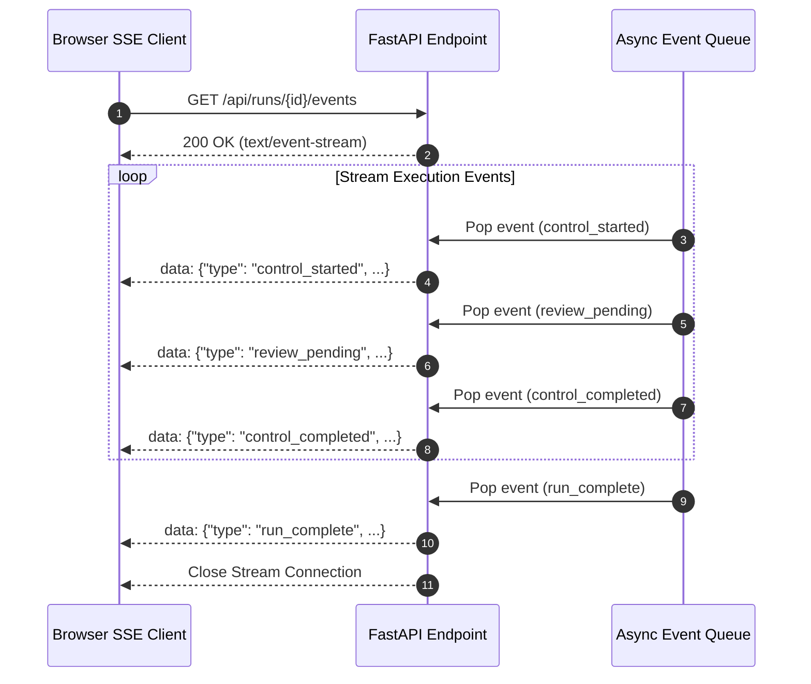
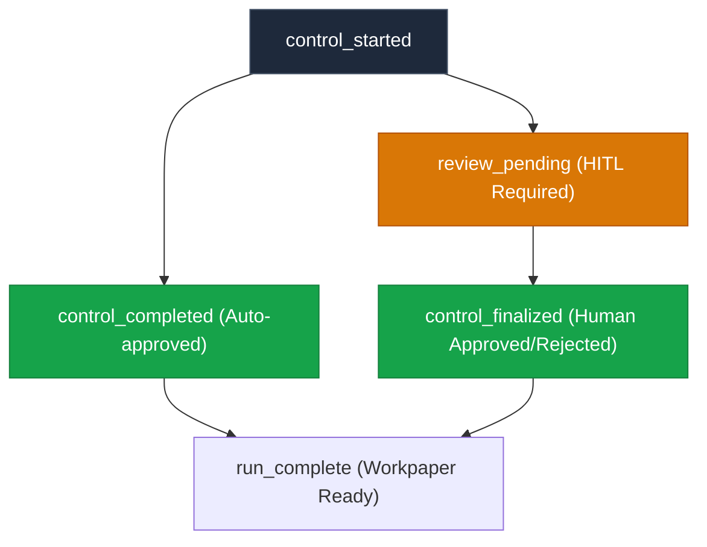
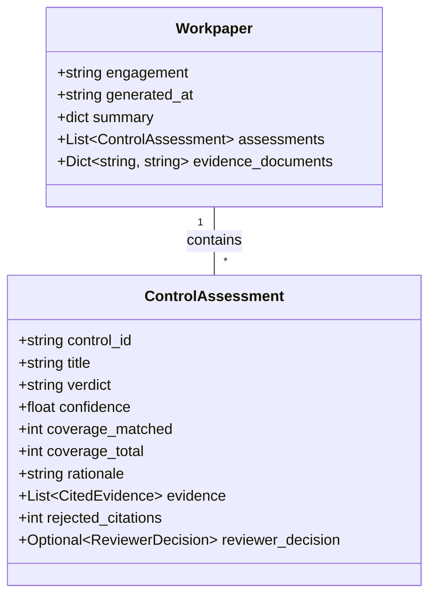

# SSE & Streaming Protocol

> **Specification for Server-Sent Events (SSE) live updates and Workpaper JSON structures.**

---

## 📡 Live Event Stream Architecture

The live viewer streams pipeline progress via **Server-Sent Events (SSE)** from `GET /api/runs/{run_id}/events`:



---

## 📊 SSE Event Types & Payloads



### Event Payload Examples

#### 1. `control_started`
```json
{
  "type": "control_started",
  "index": 0,
  "total": 12,
  "control_id": "CC6.1",
  "assessment": { "control_id": "CC6.1", "title": "Logical Access Controls", "verdict": "pending" }
}
```

#### 2. `review_pending` (Triggers Human Review UI)
```json
{
  "type": "review_pending",
  "index": 2,
  "total": 12,
  "control_id": "CC6.3",
  "assessment": {
    "control_id": "CC6.3",
    "verdict": "partially_documented",
    "confidence": 0.6,
    "coverage_matched": 1,
    "coverage_total": 2
  }
}
```

#### 3. `run_complete`
```json
{
  "type": "run_complete",
  "workpaper": {
    "engagement": "northwind-2026",
    "summary": { "documented": 10, "partially_documented": 2, "not_found": 0, "total": 12 }
  }
}
```

---

## 📄 Immutable Workpaper JSON Schema



---

## 📌 Next Steps

* Dive into the **[Verification Engine Deep Dive](../operations/verification-engine.md)**.
* Read about **[Server Deployment](../operations/deployment.md)**.
