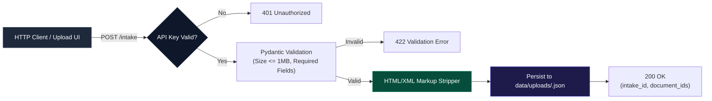
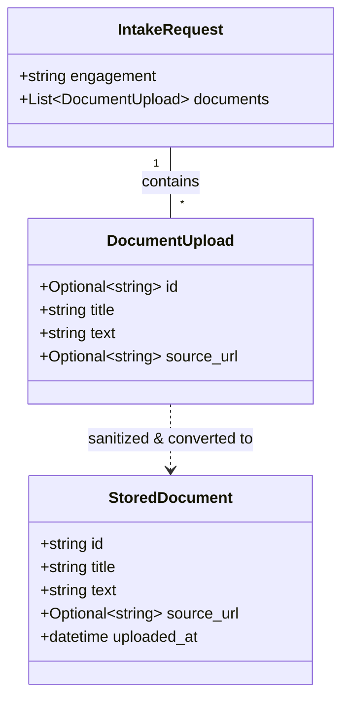
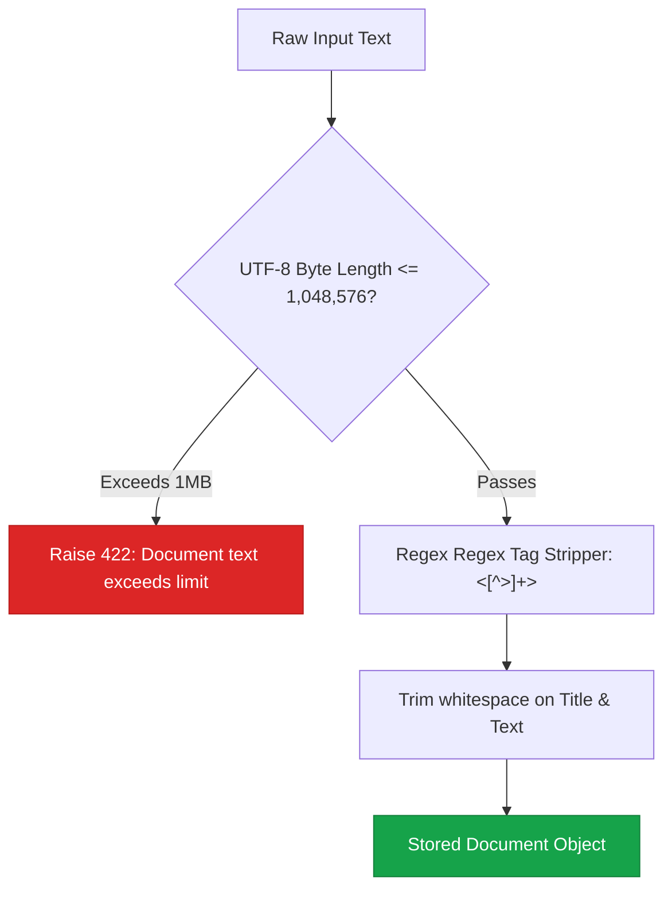

# Intake API & Data Specifications

> **API specification for document ingestion, validation, markup sanitization, and local upload storage.**

---

## 📥 Ingestion Pipeline Overview

The **Intake API** (`POST /intake`) allows clients to submit raw policy documents over HTTP. Every document is validated, stripped of dangerous or noisy HTML/XML markup, and stored as an opaque JSON artifact:



---

## 📋 API Endpoints Summary

| Method | Endpoint | Description | Auth Required |
| :--- | :--- | :--- | :--- |
| `POST` | `/intake` | Ingest and store policy documents | Optional (`X-API-Key` if configured) |
| `POST` | `/api/runs` | Initialize compliance engagement run | None |
| `GET` | `/api/runs/{id}/events` | SSE Stream for live execution logs | None |
| `POST` | `/api/runs/{id}/controls/{cid}/decision` | Submit Human-in-the-Loop decision | None |
| `GET` | `/api/runs/{id}/workpaper` | Fetch final generated Workpaper JSON | None |

---

## 📄 `POST /intake` Specification

### Request Body Schema (`IntakeRequest`)

```json
{
  "engagement": "acme-corp-soc2-2026",
  "documents": [
    {
      "title": "Access Control Policy",
      "text": "<p>All employees must use <b>multi-factor authentication</b> when accessing production systems.</p>",
      "source_url": "https://internal.acme.com/policies/access-control"
    }
  ]
}
```



---

## 🧹 Document Sanitization & Size Constraints



---

## 📂 Upload Storage & Retention Lifecycle

* **Storage Path**: Documents are saved under `data/uploads/<doc_id>.json`.
* **Git Isolation**: `data/uploads/` is ignored by Git (except `.gitkeep`).
* **30-Day Cleanup**: `cleanup_old_uploads()` automatically purges uploaded documents older than 30 days based on their `uploaded_at` timestamp.

---

## 📌 Next Steps

* Learn about **[SSE Event Streaming & Workpaper Schemas](events-sse.md)**.
* Read the **[Verification Engine Deep Dive](../operations/verification-engine.md)**.
