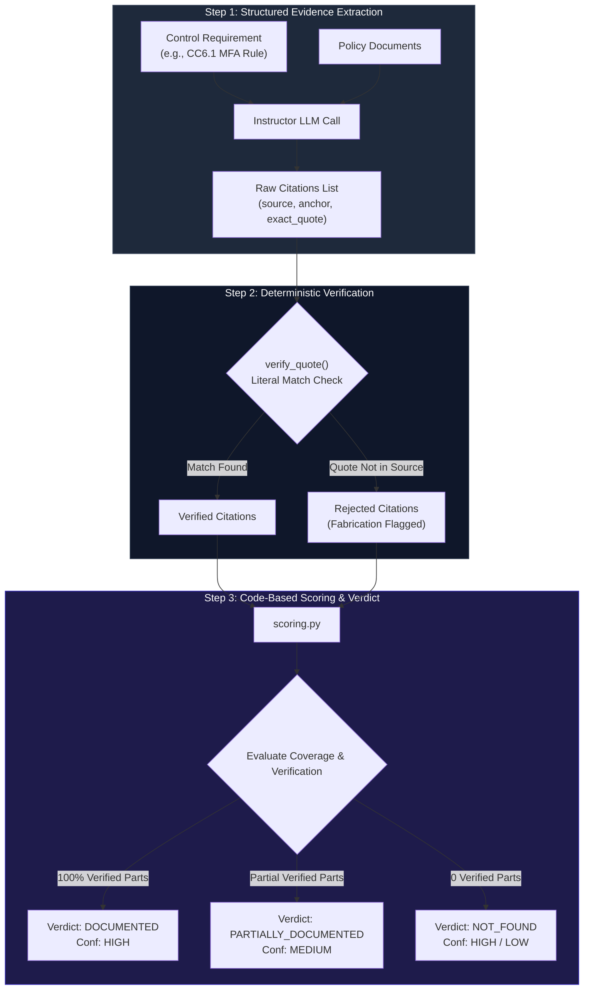
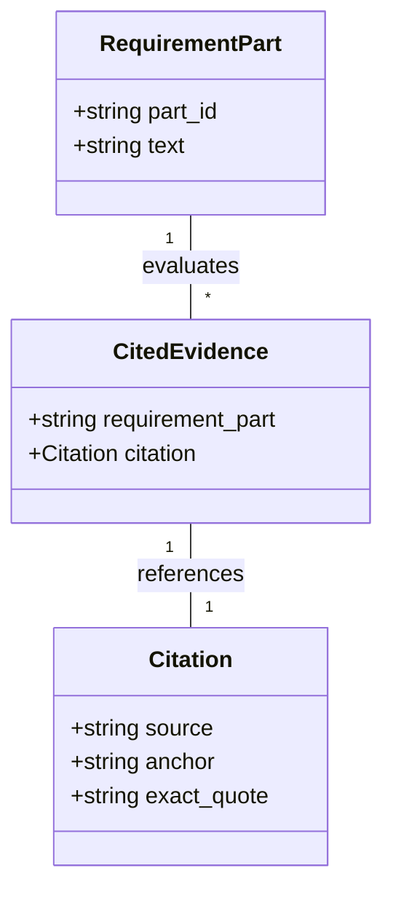
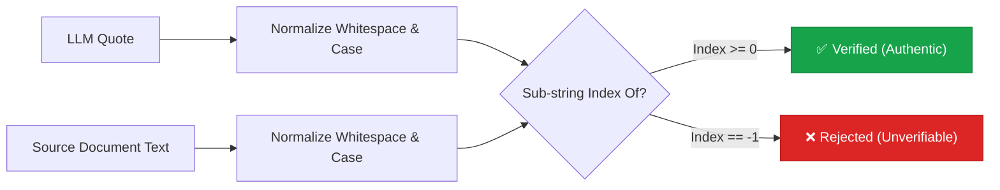

# The Core 3-Step Engine Pipeline

> **How Audit Orchestrator extracts evidence, verifies citations, and computes compliance scores deterministically.**

---

## ⚡ The 3-Step Pipeline Flow

Unlike traditional RAG systems that trust LLM outputs, Audit Orchestrator processes every control through a strict 3-step deterministic pipeline:

---

## 🔬 Pipeline Step Breakdown

### Step 1: Structured Evidence Extraction

The model receives the **Control Requirements** and **Document Set**. Using Instructor structured output, it returns a schema containing verbatim quotes for each requirement part:

---

### Step 2: Deterministic Citation Verification

Before any citation is accepted into the audit record, `verify.py` checks that `exact_quote` exists literally within `source`:

> **Anti-Fabrication Rule**: Unverifiable quotes are discarded immediately and recorded in `rejected_citations`. They can never contribute to a `documented` verdict.

---

### Step 3: Code-Based Scoring Matrix

The final verdict is derived directly from requirement coverage metrics:

| Requirement Coverage | Verified Evidence Count | Rejections Present? | Final Verdict | Confidence |
| :--- | :--- | :--- | :--- | :--- |
| **All parts met** ($N/N$) | $\ge 1$ verified quote per part | No | `documented` | **1.0** (High) |
| **Partial parts met** ($k/N$) | $\ge 1$ verified quote | No | `partially_documented` | **0.6** (Medium) |
| **No parts met** ($0/N$) | 0 verified quotes | No | `not_found` | **1.0** (High) |
| **Any parts met** | Claims met but quotes failed verification | Yes | `partially_documented` or `not_found` | **0.3** (Low) |

---

## 📌 Next Steps

* See how the pipeline is orchestrated in the **[State Machine & HITL](state-machine.md)** guide.
* Learn about string normalization in **[Deterministic Verification](../operations/verification-engine.md)**.
