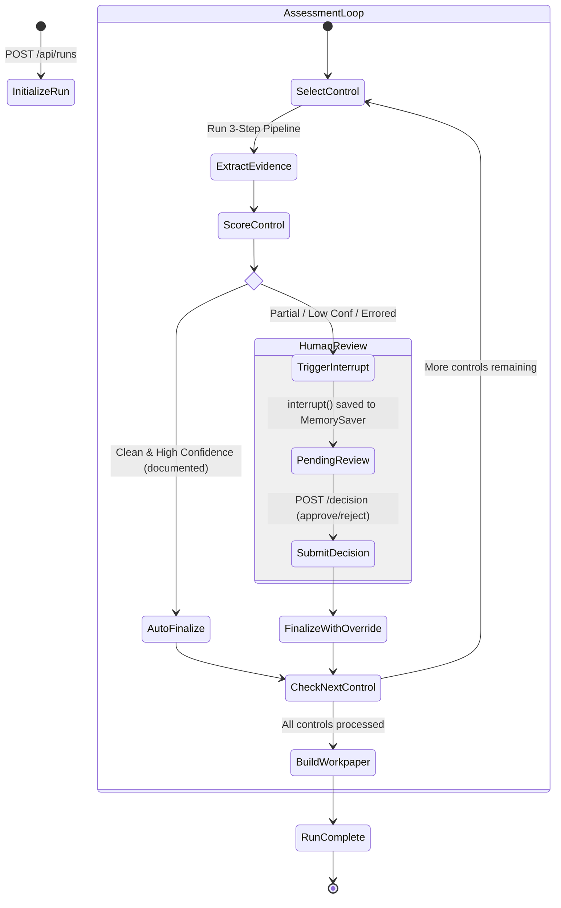
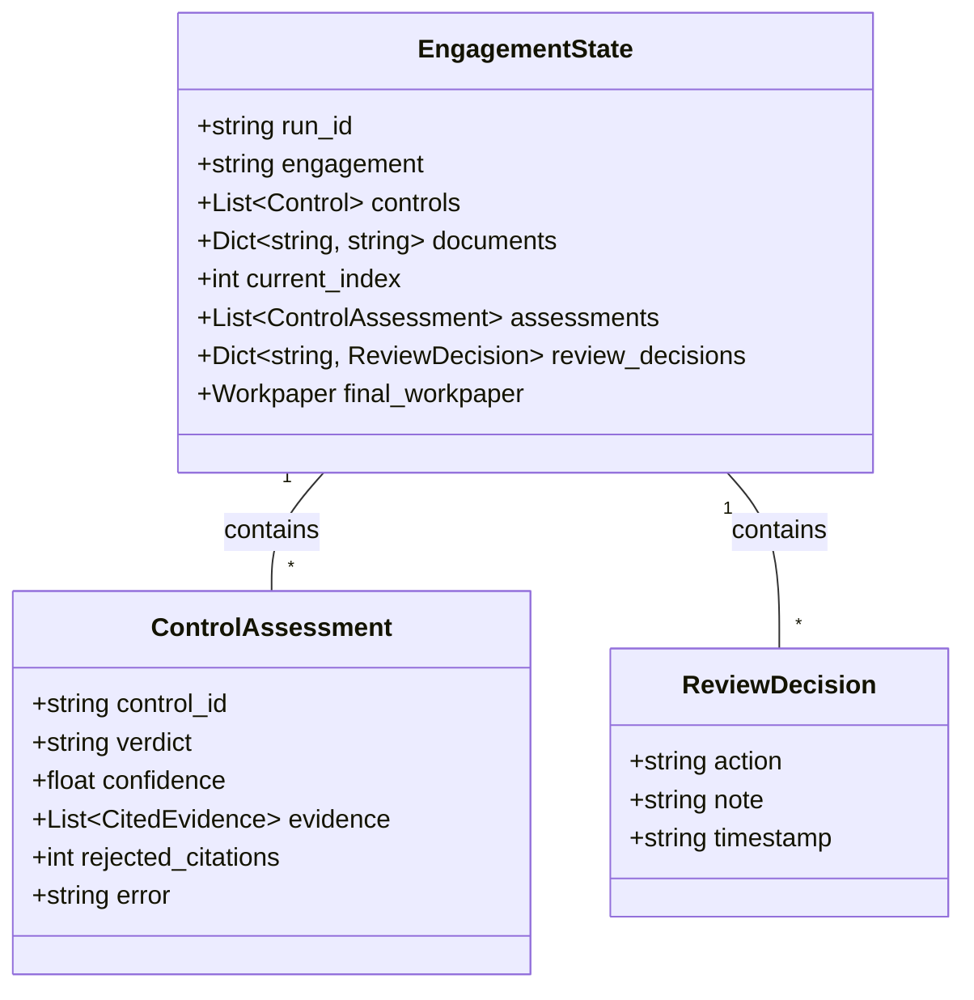
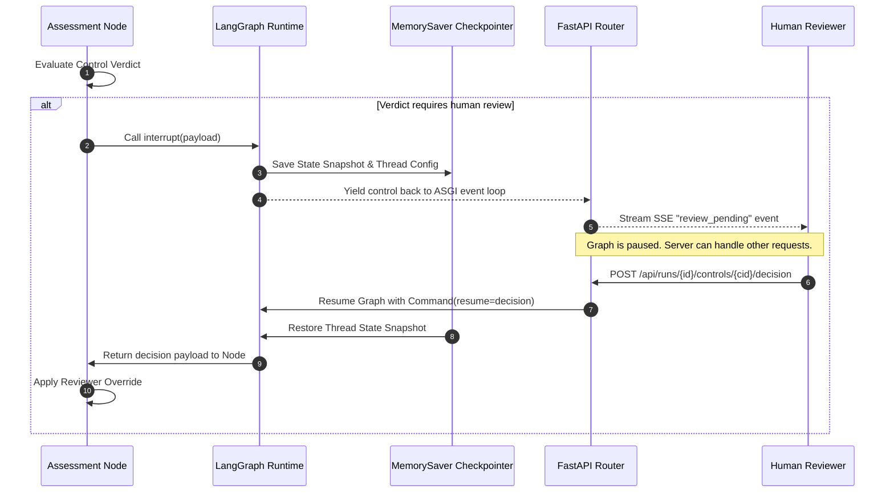

# State Machine & Human-in-the-Loop (HITL)

> **Architectural breakdown of the LangGraph state machine, checkpointing, and human review routing.**

---

## 🔄 LangGraph State Machine Workflow

The execution loop for evaluating engagement controls is built as a stateful graph using **LangGraph**:

---

## 🧠 LangGraph State Schema (`EngagementState`)

The state object passed between nodes contains the following attributes:

---

## ⏸️ Interrupt & Resume Mechanics

Audit Orchestrator uses LangGraph's native `interrupt()` feature to suspend graph execution when human intervention is required:

---

## 📌 Next Steps

* Inspect the **[Intake API Specifications](../api/intake-api.md)**.
* Learn about **[Deployment & Cloud Topology](../operations/deployment.md)**.
