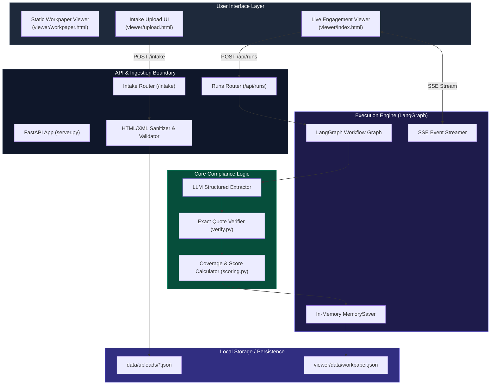
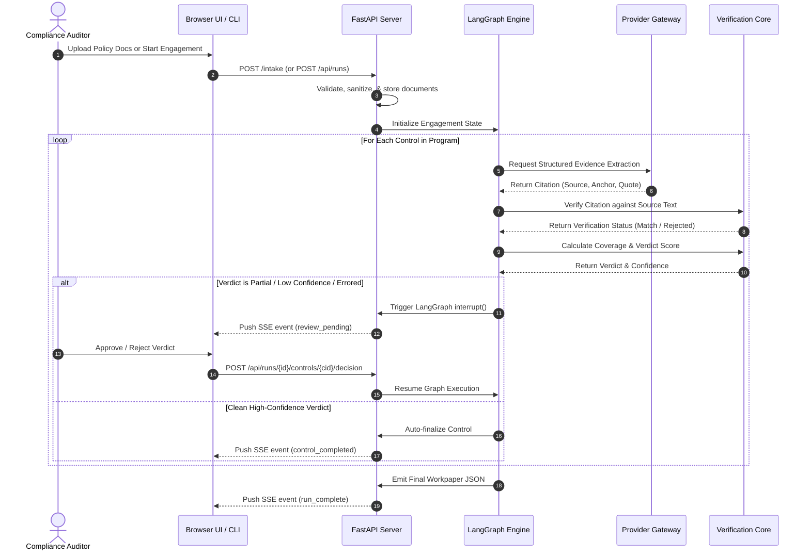

# System Architecture & High-Level Design

> **Detailed technical overview of the Audit Orchestrator system architecture, component breakdown, and runtime data flow.**

---

## 🏛️ High-Level Component Topology

Audit Orchestrator decouples the **interactive user interface**, **orchestration runtime**, and **deterministic core logic** into distinct, modular boundaries:



---

## 🔄 End-to-End Execution Sequence

The sequence below illustrates the life cycle of a compliance assessment, from document ingestion to human sign-off:



---

## 🛡️ Architectural Boundaries & Isolation

```mermaid
grid
```

### 1. Zero-Database & Process Isolation
* **Single-Process Global State**: The server operates without an external database (PostgreSQL/Redis). Active runs and events are maintained in process memory.
* **Pinned Concurrency**: Cloud deployments (Modal) enforce `max_containers=1` to guarantee consistent state without distributed synchronization overhead.

### 2. Multi-Provider Gateway Abstraction
* The core relies on an agnostic gateway (`gateway.py`) supporting **Groq**, **Google Gemini**, **Anthropic**, and **Together AI**.
* Standardized `Instructor` schemas enforce structured outputs across all model providers.

---

## 📌 Next Steps

* Deep dive into the **[Core 3-Step Pipeline](pipeline.md)** to see how citations are verified.
* Examine the **[State Machine & HITL](state-machine.md)** graph design.
