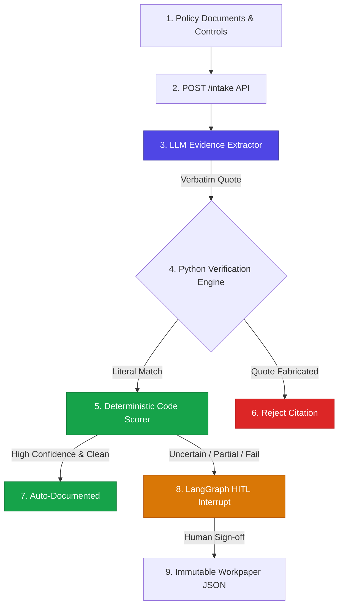
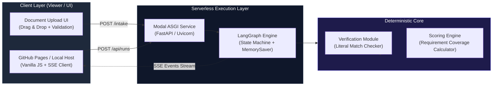

# Audit Orchestrator — Engineering Overview

> **A Grounded, Human-in-the-Loop Agent for Compliance Evidence Review**
> *Every verdict is derived in code and anchored to a deterministically verified source passage.*

---

## ⚡ Executive Summary for Hiring Managers & Engineering Leads

**Audit Orchestrator** is an enterprise AI engine designed for **compliance design and documentation testing** (e.g., SOC 2, ISO 27001). 

Instead of relying on an LLM to self-report verdicts or confidence scores, Audit Orchestrator treats the LLM as an un-trusted extractor, **derives confidence and verdicts deterministically in Python code**, and routes uncertain findings to a **Human-in-the-Loop (HITL)** approval gate via **LangGraph checkpointing**.

---

## 🎯 Key Engineering Guarantees

| Principle | Technical Implementation |
| :--- | :--- |
| **Deterministic Anti-Fabrication** | Every LLM quote is verified byte-by-byte against source documents using Python string normalization. Model hallucinations are instantly rejected. |
| **Code-Derived Verdicts** | Verdicts (`documented`, `partially_documented`, `not_found`) and confidence scores are calculated via code rules, **never** generated by LLM prompts. |
| **Fault-Tolerant HITL** | Built on **LangGraph state machines**. Low-confidence or partial controls trigger `interrupt()`, saving state to memory/disk until human approval/rejection. |
| **Production Ready Deployment** | Dual-topology architecture: **GitHub Pages** frontend + **Modal Serverless ASGI container** pinned to single-process concurrency. |

---

## 🧭 System Architecture at a Glance

---

## 🔍 Explore the Architecture & Codebase

Select a section below to dive into detailed technical documentation:

-   :material-sitemap: **[System Architecture](architecture/system-design.md)**
    ---
    Explore the high-level system design, multi-tenant isolation strategy, and serverless execution model.

-   :material-pipe: **[Core 3-Step Pipeline](architecture/pipeline.md)**
    ---
    Deep dive into Extract $\rightarrow$ Verify $\rightarrow$ Score pipeline and anti-fabrication algorithms.

-   :material-state-machine: **[State Machine & HITL](architecture/state-machine.md)**
    ---
    Learn how LangGraph checkpoints state, triggers interrupts, and handles human review resumes.

-   :material-api: **[Intake API & Data Specs](api/intake-api.md)**
    ---
    API contracts, Pydantic data validation schemas, markup sanitization, and document persistence.

-   :material-shield-check: **[Verification Engine Deep Dive](operations/verification-engine.md)**
    ---
    Read about string normalization algorithms, character mapping, and fuzzy citation matching.

-   :material-cloud-upload: **[Server & Cloud Deployment](operations/deployment.md)**
    ---
    Understand the Modal container architecture, pinned container concurrency, and CORS configuration.

