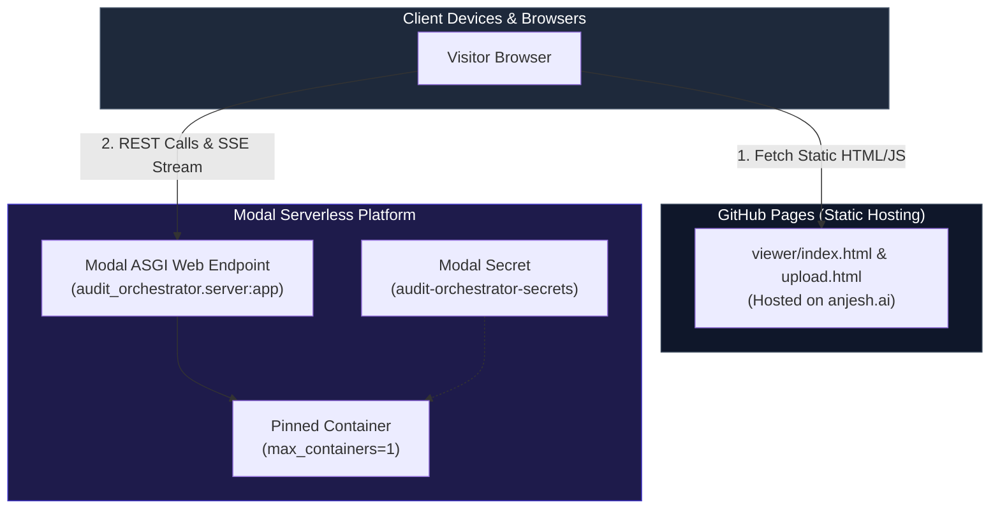
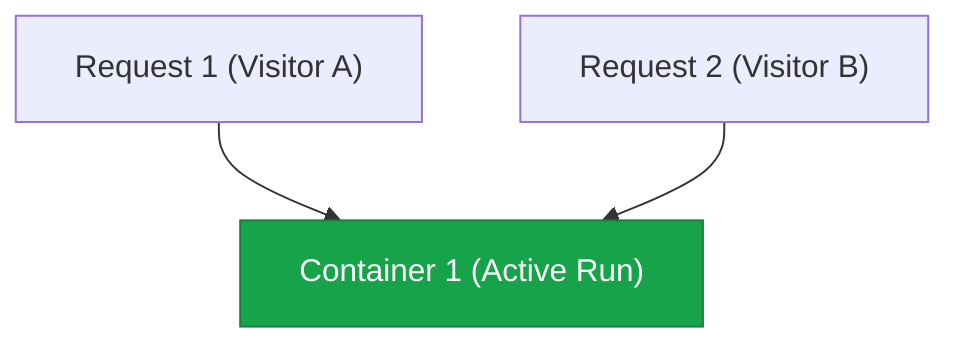

# Server & Cloud Deployment Topology

> **Production deployment strategy across Modal serverless containers and GitHub Pages static hosting.**

---

## 🌐 Hybrid Deployment Architecture

The public demo is deployed using a decoupled hybrid topology:



---

## 📌 Critical Deployment Constraint: `max_containers = 1`

Because Audit Orchestrator operates as a **lightweight, zero-database engine**, run state (`RUNS`, active connections) is held in server memory.



> **Why Pinned Concurrency Matters**: If Modal scaled out to multiple container instances, traffic would be split across different memory spaces, corrupting the live SSE stream and state machine checkpoints. `max_containers=1` prevents split-brain state issues.

---

## ⚙️ Deployment Commands & Workflow

### 1. Backend Deployment (Modal)

```bash
# Create Modal secrets from local .env
modal secret create audit-orchestrator-secrets --from-dotenv .env --force

# Deploy Modal app
modal deploy modal_app.py
```

### 2. Frontend Deployment (GitHub Actions)

Changes pushed to `main` automatically deploy `viewer/` to GitHub Pages via `.github/workflows/pages.yml`:

```mermaid
gitGraph
    commit id: "Feature Dev"
    commit id: "Add Intake UI"
    checkout main
    merge Feature
    commit id: "Trigger GitHub Action"
    commit id: "Publish to GitHub Pages"
```

---

## 🔑 Environment Variables Configuration

| Variable | Description | Required? |
| :--- | :--- | :--- |
| `INTAKE_API_KEY` | Shared secret key for `POST /intake` authentication | Optional (local dev defaults to open) |
| `AUDIT_PROVIDER` | Pin provider (`groq`, `gemini`, `anthropic`, `together`) | Optional (auto-detects first key) |
| `ALLOWED_ORIGINS` | Comma-separated CORS allowed origins | Optional (defaults to standard URLs) |
| `GROQ_API_KEY` | API Key for Groq Provider | Provider Dependent |
| `GEMINI_API_KEY` | API Key for Google Gemini Provider | Provider Dependent |
| `ANTHROPIC_API_KEY` | API Key for Anthropic Provider | Provider Dependent |

---

## 📌 Next Steps

* Review the **[Quickstart Guide](../quickstart.md)** to run locally.
* Inspect **[Intake API Specifications](../api/intake-api.md)**.
