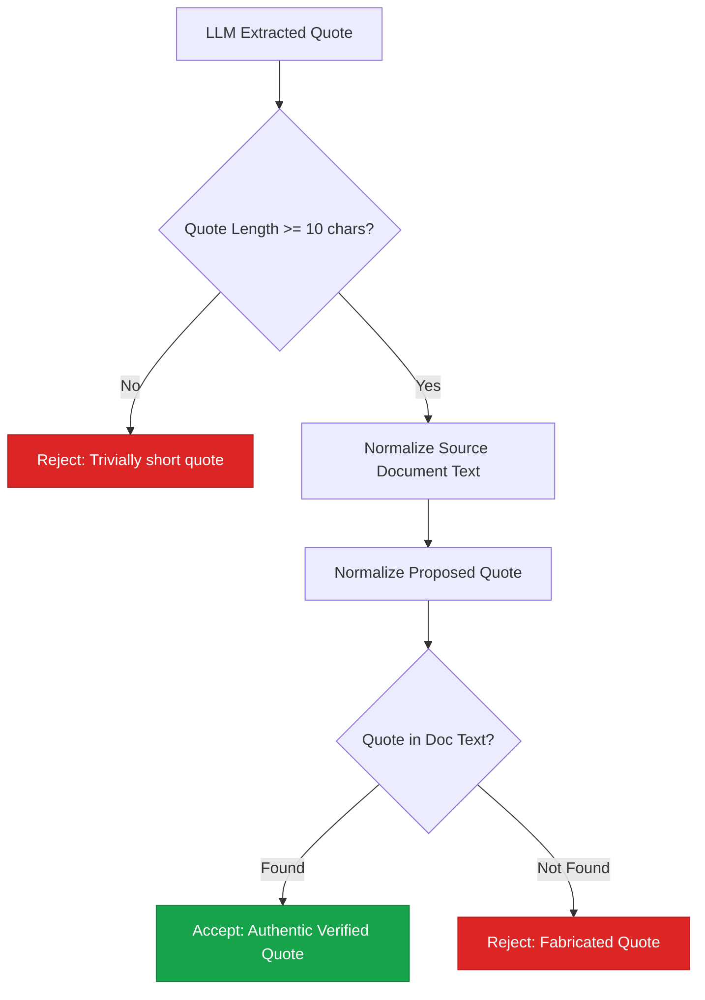
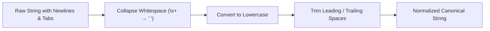
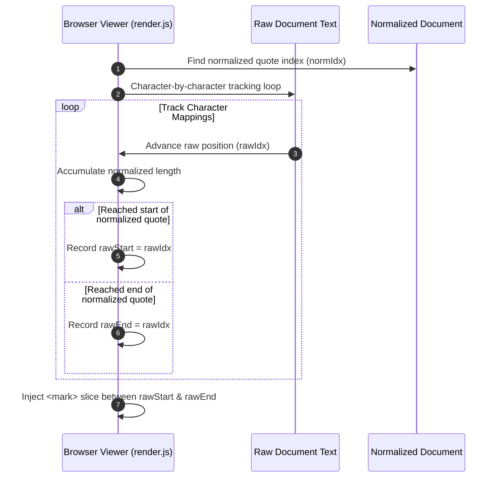

# Deterministic Verification Engine

> **Deep dive into the string normalization algorithms, quote verification rules, and anti-hallucination guarantees.**

---

## 🛡️ Anti-Hallucination Philosophy

Large Language Models (LLMs) frequently generate plausible-sounding quotes that do not exist verbatim in source text. 

Audit Orchestrator resolves this by treating LLM-extracted quotes as **untrusted proposals** and validating them against the source document using **pure Python code**:



---

## 🔤 String Normalization Algorithm

To prevent false rejections caused by minor whitespace, newline, or capitalization differences, both the source document and the quoted string pass through the exact same normalization function (`verify.py`):

$$\text{normalize}(s) = \text{lowercase}\Big(\text{regex\_replace}\big(s, \text{r}"\backslash\text{s}+", \text{" "}\big).\text{trim}()\Big)$$



### Normalization Example

```python
# Raw LLM Quote:
"All Employees  Must Use\nMulti-Factor Authentication."

# Normalized:
"all employees must use multi-factor authentication."
```

---

## 🎯 Highlighting Offset Recovery (`render.js`)

In the browser viewer, cited passages are highlighted with `<mark>` tags inside their original source document. 

Because normalization alters offsets, `render.js` walks the un-normalized raw text character-by-character to recover exact raw character indices:



---

## 🧪 Verification Test Coverage

The verification engine is covered by comprehensive unit tests (`tests/test_verify.py`):

- `test_exact_quote_verifies`: Exact matches pass.
- `test_whitespace_and_case_are_tolerated`: Newlines, double spaces, and case differences pass.
- `test_paraphrase_is_rejected`: Hallucinated paraphrases are rejected.
- `test_quote_from_unknown_document_is_rejected`: Mismatched document keys fail immediately.
- `test_trivially_short_quote_is_rejected`: Single words or short fragments are rejected.

---

## 📌 Next Steps

* Review **[Server & Cloud Deployment](deployment.md)** architecture.
* See the **[Quickstart Guide](../quickstart.md)** to run tests locally.
